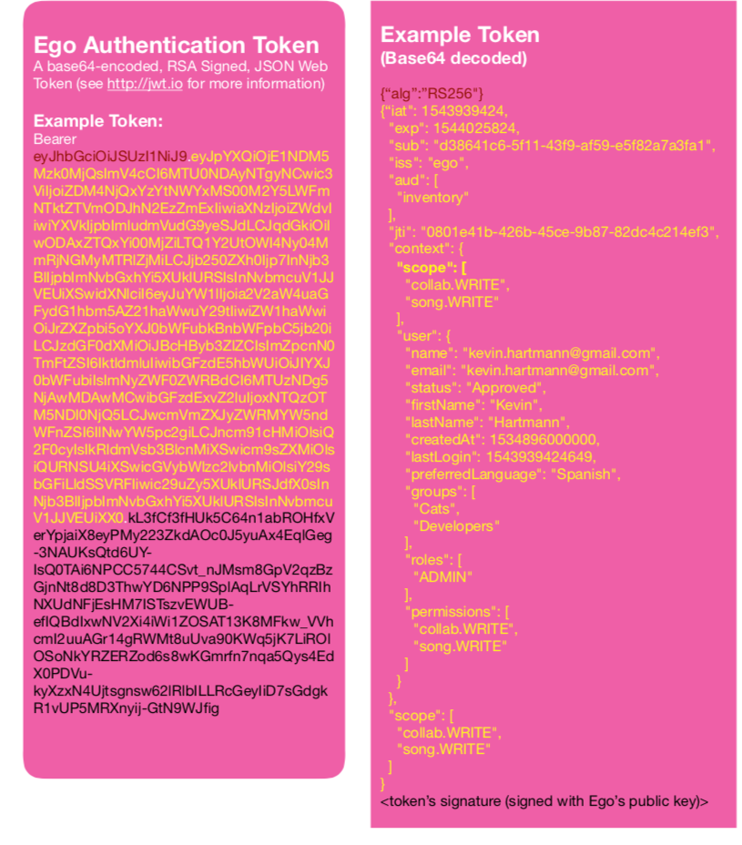

Authentication Tokens
=====================

Authentication concerns who the user *is*. User Authentication tokens are used
to verify a user's identity. 

Ego's User Authentication tokens are signed JSON Web Tokens (see http://jwt.io) that Ego issues when a user successfully logs into Ego using their Google or Facebook credentials. 

Ego will then issue an authentication token, which confirms the user's identity, and contains information about the user's name, their role (user or adinistrator), and any applications, permissions, and groups associated with their Ego account. 

An authentication token contains all of the information that ego has about a given user, including which groups they are a part of, which applications they are authorized to use , which permissions they have to use those appliactions.

This data current as of the time the token is issued, and the token is 
digitally signed by Ego with a publicly available signing key that applications
have use to verify that an authentication token is valid. Most of Ego's 
REST endpoints require an Ego authentication token to validate the user's
identity before operating on their data. 

